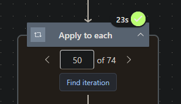
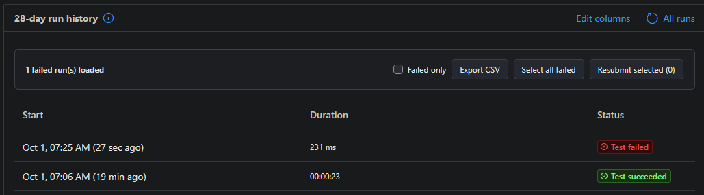

#  PA Bud

PA Bud is a Chrome and Firefox debugging companion for Power Automate flows. It helps you find loop iterations, understand failed runs, and work through run history.

## Features

- **Find loop iterations:** enter a condition such as `item()['id'] == 3` and jump directly to a matching **Apply to each** iteration.
- **See failures inline:** read and copy the error under each failed run without opening it. This works in the 28-day history and **All runs** view.
- **Triage runs:** group identical errors, show only failed runs, export loaded runs to CSV, or select failed runs for resubmission.
- **Scan flow lists:** see each flow's last-run status and error.

## Screenshots

The button appears when you expand an **Apply to each** loop:



Search the loop's items and choose a match:


The run-history toolbar provides filtering, CSV export, and bulk resubmission:



## Find an iteration

On a run page, expand a loop and click **Find iteration**. Enter a condition, click **Find matches**, then choose a result. The finder loads the loop's input array once and searches it locally; it does not make a request for each item.

| Kind | Supported syntax | Example |
| --- | --- | --- |
| Current item and properties | `item()`, `item().name`, `item()['name']`, `item()[0]`, `item()?['name']` | `item()['id'] == 3` |
| Values | Numbers, quoted strings, `true`, `false`, `null` | `item().active == true` |
| Comparisons | `==`, `!=`, `===`, `!==`, `<`, `<=`, `>`, `>=` | `item().amount >= 100` |
| Logic | `&&`, `\|\|`, `!`, parentheses | `item().active && item().amount > 10` |
| Iteration index | `index()` (starts at 0) | `index() == 2` |
| Matching helpers | `equals(a, b)`, `contains(a, b)`, `startsWith(a, b)`, `endsWith(a, b)` | `contains(item().name, 'test')` |
| Value helpers | `empty(a)`, `length(a)`, `toLower(a)` | `toLower(item().status) == 'failed'` |

`==` and `!=` convert values when needed (`3 == '3'`); `===`, `!==`, and `equals(a, b)` do not. This is a small expression language, not full JavaScript or the full Power Automate expression language.

Secure or unavailable loop inputs cannot be searched. For a nested loop, open its current parent iteration first.

## How it works

PA Bud uses your existing Power Automate session to read run details from Microsoft's APIs. It fetches failed-action details and loop inputs as needed, then displays and searches them in your browser. There is no PA Bud server or analytics service.

## Build and test

The `chrome/` and `firefox/` folders contain browser-specific manifests; runtime code and icons live under `shared/`.

```powershell
.\chrome\build.ps1
.\firefox\build.ps1
node --test shared/tests/*.test.cjs
```

The ZIPs appear in `chrome/dist/` and `firefox/dist/`. Extract the relevant ZIP before loading it: use **Load unpacked** in `chrome://extensions` or **Load Temporary Add-on** in Firefox's `about:debugging`. Firefox temporary add-ons disappear when Firefox restarts; a lasting install requires a signed add-on.

## Troubleshooting

Power Automate's internal API and page layout can change. If PA Bud stops working, check the browser console for `[pa-bud]` or `[pa-bud:iterations]` messages. `window.__paRunErrorsState` shows captured runs; `window.__paIterationFinderDebug()` shows whether the finder recognized the current run.

## Known limitations

- English UI and commercial Power Automate hosts only.
- Error details appear after the run table loads; nested failures are best effort.

## Contributing

Issues and pull requests are welcome, however changes are not guaranteed. Please describe the change and include relevant tests when possible.

## AI Disclosure

AI tools assisted with portions of this project. Maintainers review and test changes.

## License

See [LICENSE](LICENSE).
